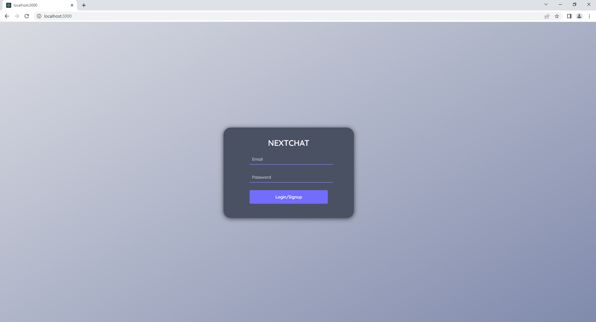

# A RealTime chatApp made with nextjs 

## the app was made with nextjs and normal css in addition to the use of Chatengine.io that was a great help for the api 

## Check the app with this link [Click me](https://nextchatapp-tau.vercel.app/)

## the index page 

## the chat App 
 

## the app have also a view status (red:unseen,green:seen)

